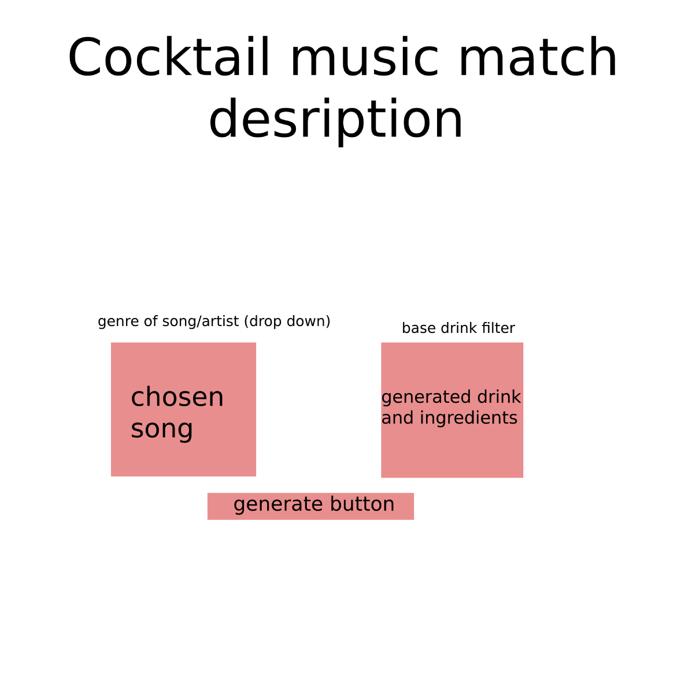

# CocktailMusicMatch

Have a Cocktail with a recipe generated with a game to play while I enjoy it.

## User Story
As a cocktail hobbyist, I want to see a random cocktail and game, So I can enjoy new drinks and gaming.

## Wireframe Example: 

## Tasks/Features
* Generate a game that is playable in browser and drink with a recipe
* Be able to filter by which type of base drink you'd like

## Installation

Only applys to the games, if you'd like to play them.

## Usage

When opeing our site you will be presented with two options, either select a base for your drink, or select Previous Choice.

You can select the drop down arrow next to "Base Beverage Section" and see what options you have to select from.

Once you select an option, a drink recipe will appree, along with a random game that would bae fun to play while having your drink.

You will be able to click on the game, when you are ready to play, and you will be taken to the game for further instructions.

If you decided to just play a previously selected game, you are welcome to go back by selecting "Previous Choice".

Please take some time and enjoy the games.

## Credits

Laura: Frontend, Tailwinds, Presentation  
https://github.com/labeutler 
Sal: Local Storage, Wireframe/Proposal 
https://github.com/salvo-t
Griff: Modal, Presentation, Proposal 
https://github.com/GriffinNB 
Josh: JavaScript, APIs, Git Organization 
https://github.com/JCool221 
Harper: JavaScript, APIs, Project Management 
https://github.com/hklotz13

## APIs:

https://www.thecocktaildb.com/ 
Game api 

https://www.thecocktaildb.com/api/json/v1/1/random.php
Drink api

## License

No license requested